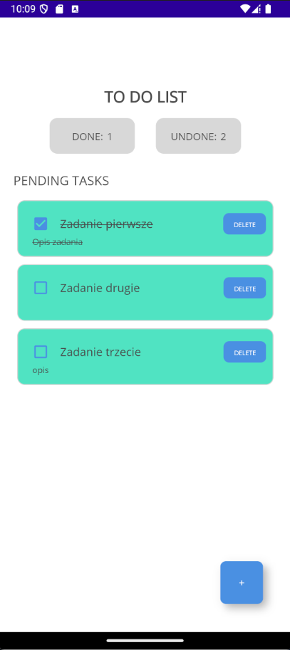

# ToDoListFT

ToDoListFT is a mobile application built using .NET MAUI that allows users to manage a to-do list. This application was created as part of a recruitment task to demonstrate my skills in mobile application development using .NET MAUI.

## Features

- **Add New Task**: Users can add a new task by providing a title and an optional description.
- **View Tasks**: Newly added tasks automatically appear on the list.
- **Mark Task as Completed**: Users can mark a task as completed by clicking the corresponding checkbox.
- **Delete Task**: Users can delete a task from the list.
- **Persistent Storage**: The task list is saved locally to ensure it is not lost when the application is closed.

## Screenshots




## Getting Started

### Prerequisites

- [.NET 8 SDK](https://dotnet.microsoft.com/download/dotnet/8.0)
- [Visual Studio 2022](https://visualstudio.microsoft.com/vs/) with .NET MAUI workload installed

### Installation

1. Clone the repository:

```
git clone https://github.com/mdkochanowicz/ToDoListFT.git
cd ToDoListFT
```

2. Open the solution in Visual Studio 2022.

3. Restore the NuGet packages:
```
dotnet restore
```

4. Build and run the project:
```
dotnet build -t:Run -f net8.0-android
```

## Usage

- **Add Task**: Click the "+" button to navigate to the "Add Task" screen. Enter the task title and description, then click "Add Task".
- **View Tasks**: The main screen displays a list of pending tasks. Completed tasks are shown with a strikethrough.
- **Delete Task**: Click the "DELETE" button next to a task to remove it from the list.
- **Mark Task as Completed**: Check the checkbox next to a task to mark it as completed.


    
